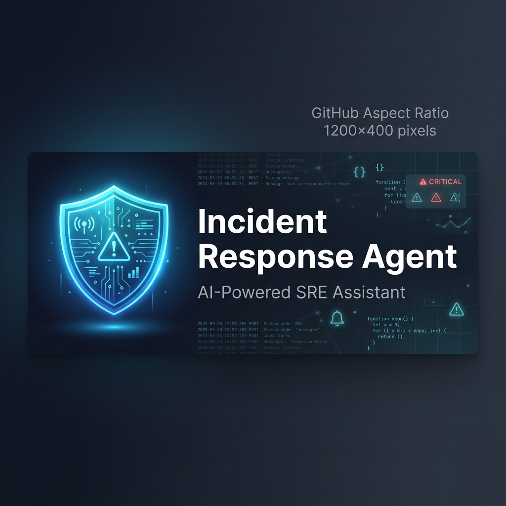
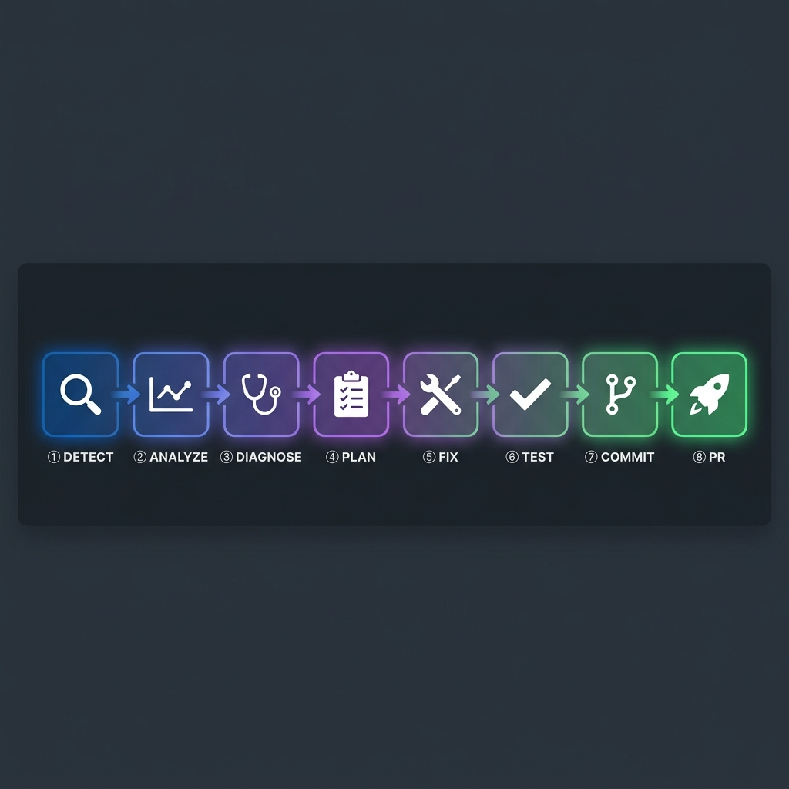
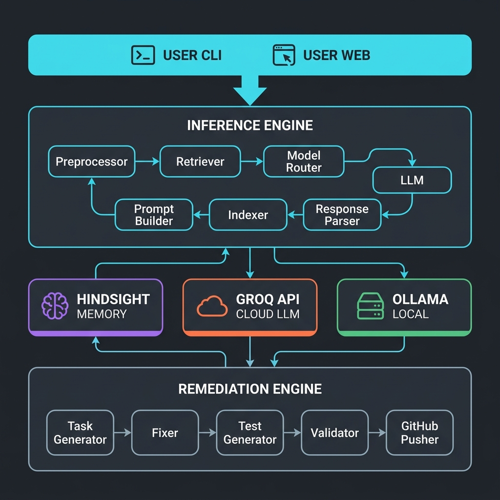
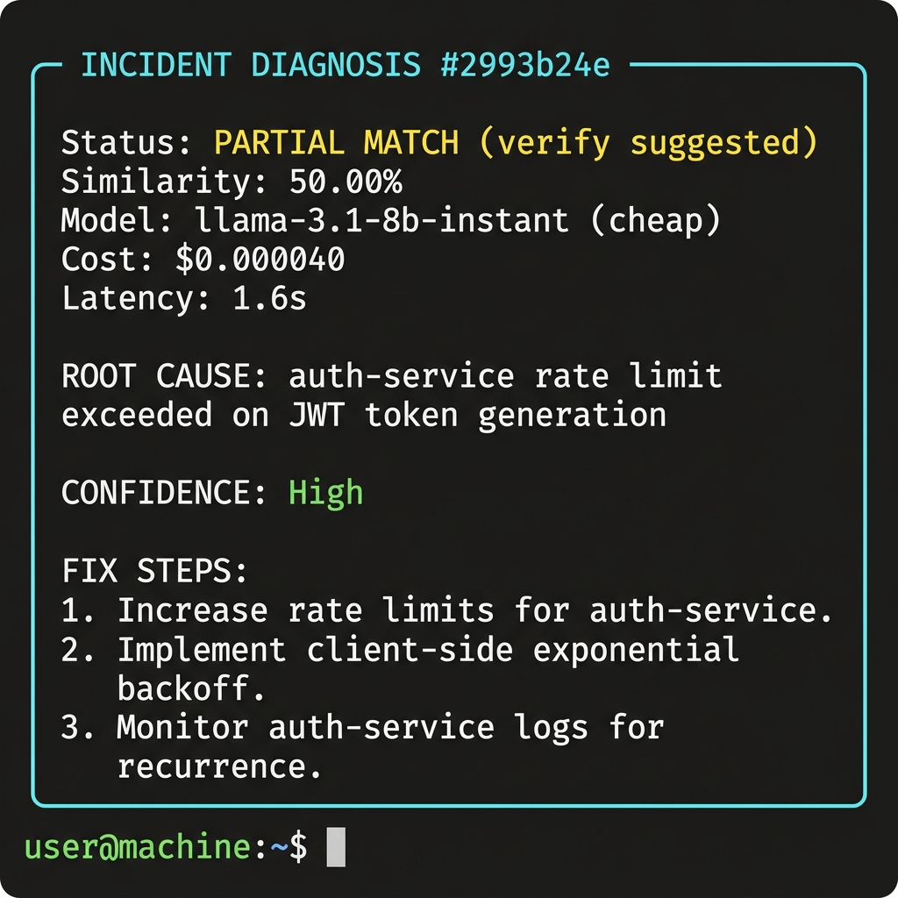
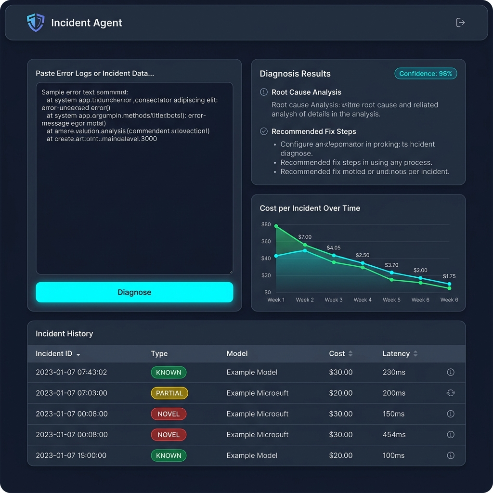
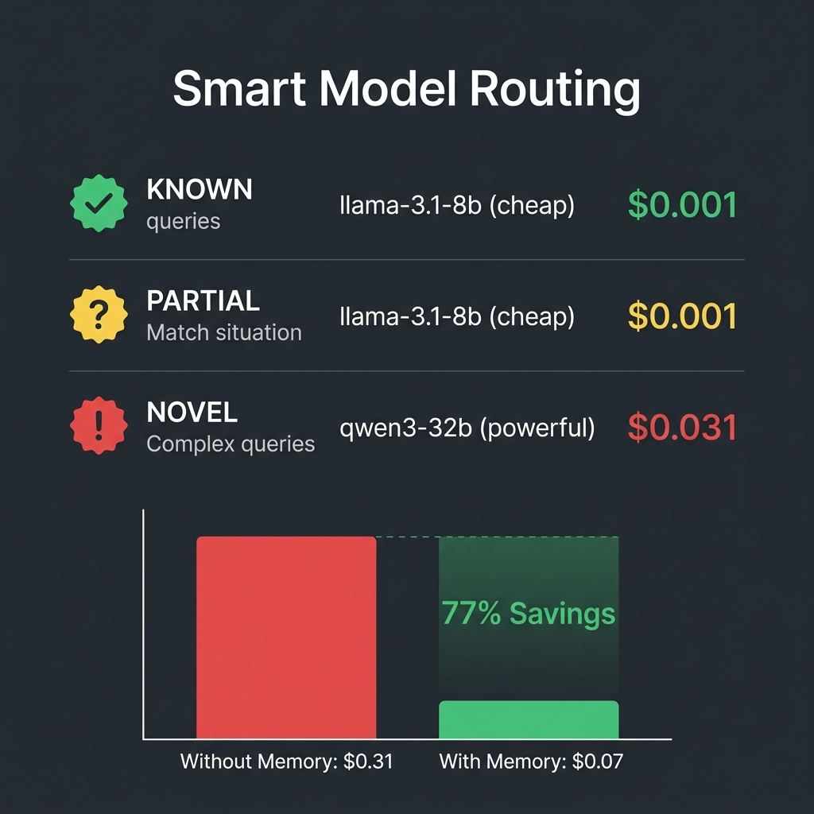

<p align="center">
  
</p>

<p align="center">
  <strong>AI-powered SRE assistant that diagnoses failures, auto-remediates with tested fixes, and pushes PR-ready code — learning from every incident.</strong>
</p>

<p align="center">
  <a href="https://github.com/Kolavara/Incident-agent/actions"></a>
  <a href="https://www.python.org/downloads/"></a>
  <a href="https://github.com/Kolavara/Incident-agent/blob/main/LICENSE"></a>
  <a href="https://console.groq.com"></a>
</p>

---

Built for DevOps and SRE teams who need fast, cost-effective incident response. Uses **[Hindsight](https://ui.hindsight.vectorize.io)** for persistent memory (the agent learns from every resolved incident) and **[cascadeflow](https://pypi.org/project/cascadeflow/)** for intelligent model routing (known incidents use cheap models, novel ones use powerful models).

## Table of Contents

- [How It Works](#how-it-works)
- [Key Features](#key-features)
- [Architecture](#architecture)
- [Quick Start](#quick-start)
- [CLI Reference](#cli-reference)
- [Web Dashboard](#web-dashboard)
- [Memory System (Hindsight)](#memory-system-hindsight)
- [Cost-Optimized Routing (cascadeflow)](#cost-optimized-routing-cascadeflow)
- [Auto-Remediation Pipeline](#auto-remediation-pipeline)
- [GitHub Integration](#github-integration)
- [Configuration](#configuration)
- [Running Tests](#running-tests)
- [Docker](#docker)
- [Project Structure](#project-structure)
- [Error Handling](#error-handling)
- [Contributing](#contributing)
- [License](#license)

---

## How It Works

The agent runs an 8-step pipeline — from raw error log to a merged Pull Request — with a single command:

<p align="center">
  
</p>

**One command does it all:**

```bash
python main.py remediate          # Steps 4–8: plan → fix → test → commit → push
python main.py remediate-demo     # Same, on synthetic PayStream incidents
```

**Or step by step:**

```bash
python main.py diagnose           # Steps 1–3: log → analysis → root cause
python main.py remediate-plan     # Preview fix tasks before applying
python main.py remediate          # Apply fixes, run tests, create PR
```

---

## Key Features

| Feature | Description |
|---|---|
| 🔍 **Intelligent Diagnosis** | Paste any error log — get structured root cause, confidence score, and actionable fix steps |
| 🧠 **Persistent Memory** | Hindsight (or local JSON fallback) remembers past incidents and their resolutions |
| 💰 **Cost-Optimized Routing** | Known incidents route to cheap models (~$0.001); novel ones to powerful models (~$0.031) |
| 🚨 **Budget Caps** | Automatically switches to local Ollama when your spend limit is reached |
| 🛠️ **Auto-Remediation** | Generates fix tasks → applies config/code changes → runs tests → creates PR-ready branches |
| 🔗 **GitHub Integration** | Pushes fix branches and creates Pull Requests via `gh` CLI, REST API, or git push |
| 📊 **Full Audit Trail** | Tracks cost, latency, model used, and incident history for every diagnosis |
| 🌐 **Web Dashboard** | React + Vite frontend with real-time diagnosis, cost charts, and pipeline progress |
| 🔌 **Offline Mode** | Works entirely offline with a local file store — no API keys required for the demo |

---

## Architecture

<p align="center">
  
</p>

The system is composed of two core engines:

- **Inference Engine** — Preprocesses logs, searches memory for past incidents, routes to the optimal model via cascadeflow, and parses structured diagnosis output.
- **Remediation Engine** — Takes diagnosis results and generates fix tasks, applies changes, generates and runs pytest validation, then commits and pushes a PR to GitHub.

Both engines are backed by three external services (all optional with fallbacks):

| Service | Purpose | Fallback |
|---|---|---|
| **Hindsight** | Vector memory for past incidents | Local JSON store (`data/memory_store.json`) |
| **Groq API** | Fast cloud LLM inference | Ollama local models |
| **GitHub** | PR creation and branch pushing | Local git branches + manual PR URL |

---

## Quick Start

### Prerequisites

| Requirement | Purpose | Required? |
|---|---|---|
| **Python 3.11+** | Runtime | ✅ Yes |
| **[Groq API key](https://console.groq.com/keys)** (free) | LLM inference | ✅ For live mode |
| **[Hindsight API key](https://ui.hindsight.vectorize.io)** | Vector memory | ❌ Optional |
| **[Ollama](https://ollama.ai)** | Local model fallback | ❌ Optional |
| **[GitHub CLI](https://cli.github.com/)** | PR creation | ❌ Optional |
| **Node.js 18+** | Web dashboard | ❌ Only for UI |

### Installation

```bash
# Clone the repo
git clone https://github.com/Kolavara/Incident-agent.git
cd Incident-agent

# Install dependencies
pip install -r requirements.txt

# Configure environment
cp .env.example .env
# Edit .env — set at minimum your GROQ_API_KEY
```

### Try it out

```bash
# 1. Offline demo (no API keys needed)
python main.py demo-offline

# 2. Full remediation demo (applies fixes + creates PRs)
python main.py remediate-demo

# 3. Diagnose a real incident
python main.py diagnose
# Paste your error log, then press Ctrl+D (or type END on a new line)
```

---

## CLI Reference

### Diagnosis & Memory

| Command | Description |
|---|---|
| `python main.py diagnose` | Paste an error log → get structured root cause + fix steps |
| `python main.py diagnose-mock` | Offline simulated diagnosis (no API calls) |
| `python main.py resolve` | Mark the last incident as resolved and store in memory |
| `python main.py history` | Display all past incidents stored in memory |
| `python main.py audit` | Show the full audit trail with costs and latency |

### Demo

| Command | Description |
|---|---|
| `python main.py demo` | Automated diagnosis demo (requires Groq API key) |
| `python main.py demo-offline` | Diagnosis demo without any API calls |

### Remediation

| Command | Description |
|---|---|
| `python main.py remediate` | Full pipeline: plan → fix → test → commit → PR |
| `python main.py remediate-plan` | Preview the remediation plan without applying changes |
| `python main.py remediate-demo` | Demo auto-remediation on synthetic PayStream incidents |

### Example CLI Output

<p align="center">
  
</p>

---

## Web Dashboard

The project includes a browser-based dashboard built with **FastAPI** (backend) and **React + Vite + TypeScript** (frontend).

<p align="center">
  
</p>

```bash
# Start both servers with one command
bash start.sh

# Or start them manually:
# Backend  → http://localhost:8000 (API docs at /docs)
cd backend && uvicorn main:app --reload --port 8000

# Frontend → http://localhost:5173
cd frontend && npm install && npm run dev
```

The dashboard provides:
- **Real-time incident diagnosis** with a log input panel
- **Cost tracking charts** powered by Recharts
- **Remediation pipeline progress** visualization
- **Incident history table** with filtering and search

---

## Memory System (Hindsight)

Hindsight is a persistent memory layer that stores resolved incidents as vector embeddings. When a new incident arrives:

1. The error log is cleaned and embedded into a vector
2. Hindsight searches for similar past incidents via cosine similarity
3. Classification determines routing:

| Similarity | Classification | Action |
|---|---|---|
| ≥ 0.8 | **KNOWN** | Route to cheap model |
| 0.5 – 0.8 | **PARTIAL MATCH** | Route to cheap model with verification |
| < 0.5 | **NOVEL** | Route to powerful model |

When an incident is resolved, it's stored back with root cause, fix applied, service, and resolution time. **Over time, the agent gets smarter and cheaper.**

> **No Hindsight API key?** The system falls back to a local JSON file store (`data/memory_store.json`) with keyword-based similarity search. No external dependencies required.

---

## Cost-Optimized Routing (cascadeflow)

cascadeflow routes each incident to the most cost-effective model based on memory similarity:

<p align="center">
  
</p>

| Incident Type | Model | Approx. Cost |
|---|---|---|
| **KNOWN** (≥ 0.8) | `groq/llama-3.1-8b-instant` | ~$0.001 |
| **PARTIAL** (0.5–0.8) | `groq/llama-3.1-8b-instant` | ~$0.001 |
| **NOVEL** (< 0.5) | `groq/qwen/qwen3-32b` | ~$0.031 |
| **Budget Exhausted** | `ollama/llama3` (local) | $0.000 |

### Cost savings in practice

| Scenario | Without Memory | With Memory | Savings |
|---|---|---|---|
| 10 incidents (8 known, 2 novel) | $0.310 (10 × $0.031) | $0.070 (8 × $0.001 + 2 × $0.031) | **~77%** |

---

## Auto-Remediation Pipeline

When you run `python main.py remediate`, the engine executes steps 4–8:

| Step | Component | What It Does |
|---|---|---|
| **④ Plan** | `TaskGenerator` | Maps fix steps to actionable tasks: `config_edit`, `code_edit`, `file_create`, `k8s_manifest`, `script_run` |
| **⑤ Fix** | `Fixer` | Applies changes to the target repo (`fixes/paystream/`): edits YAML configs, K8s manifests, source code |
| **⑥ Test** | `TestGenerator` | Generates pytest files tailored to each fix (network policy tests, config validation, pool health checks) |
| **⑦ Validate** | `Validator` | Runs 8+ validation tests and reports pass/fail |
| **⑧ Push** | `GitHubPusher` | Commits to a feature branch and creates a Pull Request via `gh` CLI (or REST API / git push fallback) |

### Supported Fix Task Types

| Type | Description | Example |
|---|---|---|
| `config_edit` | Modify YAML/JSON config files | Update rate limit, pool size, timeout |
| `code_edit` | Modify source code files | Fix connection leak, add retry logic |
| `file_create` | Create new config or test files | Add network policy, generate test suite |
| `k8s_manifest` | Update Kubernetes deployment YAMLs | Scale replicas, add probes, update env vars |
| `script_run` | Execute a shell command | `kubectl scale deployment`, `restart pod` |

### Example Output

<details>
<summary>📋 Diagnosis result</summary>

```
┌─────────────────────────────────────────────────────────────────┐
│                    INCIDENT DIAGNOSIS #2993b24e                 │
├─────────────────────────────────────────────────────────────────┤
│ Status    : [?] PARTIAL MATCH (verify suggested)               │
│ Incident ID: 2993b24e                                          │
│ Similarity: 50.00%                                             │
│ Model      : llama-3.1-8b-instant (cheap)                      │
│ Cost       : $0.000040                                         │
│ Latency    : 1.6s                                              │
│                                                                │
│ ROOT CAUSE: auth-service rate limit exceeded on JWT            │
│ token generation endpoint — possible brute force attack        │
│                                                                │
│ CONFIDENCE: High                                               │
│                                                                │
│ FIX STEPS:                                                     │
│   1. Review/adjust auth-service rate limiting config           │
│   2. Implement Leaky Bucket algorithm for brute force          │
│   3. Add IP blocking + user-ID based rate limiting             │
│                                                                │
│ Past incidents in context:                                     │
│   • JWT token expiry (sim: 50%)                                │
│   • JWT token validation failure (sim: 50%)                    │
└─────────────────────────────────────────────────────────────────┘
```

</details>

<details>
<summary>🛠️ Remediation result</summary>

```
┌────────────────── REMEDIATION RESULT ──────────────────┐
│                                                        │
│  Tasks: 1 total                                        │
│    Applied: 1                                          │
│                                                        │
│  Validation: PASSED                                    │
│    8/8 tests passed                                    │
│                                                        │
│  Pull Request: Created 🎉                              │
│    URL: https://github.com/user/repo/pull/4            │
│                                                        │
│  Changes applied in: fixes/paystream/                  │
│    → k8s/network-policies/restrict-payment-access.yaml │
│      (IP blocking + rate limiting)                     │
└────────────────────────────────────────────────────────┘
```

</details>

---

## GitHub Integration

The `GitHubPusher` supports three methods, tried in priority order:

| Priority | Method | Requires | Creates PR? |
|---|---|---|---|
| 1 | `gh` CLI | `gh` installed + authenticated | ✅ Yes |
| 2 | REST API | PAT with `Contents: write` + `Pull requests: write` | ✅ Yes |
| 3 | Git Push | Any auth method | ⚠️ Branch only (provides PR URL) |

### Setup

```bash
# Option A: GitHub CLI (recommended)
winget install GitHub.cli       # or brew install gh
gh auth login

# Option B: Personal Access Token
# Add to .env:
GITHUB_TOKEN=github_pat_...
GITHUB_REPO_OWNER=your-username
GITHUB_REPO_NAME=paystream-infra
```

**Fine-grained PAT permissions** needed on the target repo:
- **Contents** — Read and write
- **Pull requests** — Read and write
- **Metadata** — Read (auto-granted)

---

## Configuration

### Environment Variables

Create a `.env` file from the provided template:

```bash
cp .env.example .env
```

| Variable | Default | Required | Description |
|---|---|---|---|
| `GROQ_API_KEY` | — | Yes* | Groq API key for LLM calls |
| `HINDSIGHT_API_KEY` | — | No | Hindsight API key for vector memory |
| `HINDSIGHT_BASE_URL` | `https://api.hindsight.vectorize.io` | No | Hindsight API endpoint |
| `HINDSIGHT_PIPELINE_ID` | `incident-memory-bank` | No | Hindsight pipeline/bank ID |
| `GITHUB_TOKEN` | — | No | GitHub PAT for PR creation |
| `GITHUB_REPO_OWNER` | — | No | GitHub username/org for the fixes repo |
| `GITHUB_REPO_NAME` | `paystream-infra` | No | GitHub repo name for fixes |
| `BUDGET_CAP_USD` | `1.00` | No | Max spend before switching to Ollama |
| `CHEAP_MODEL` | `groq/llama-3.1-8b-instant` | No | Model for known/partial incidents |
| `POWERFUL_MODEL` | `groq/qwen/qwen3-32b` | No | Model for novel incidents |
| `LOCAL_MODEL` | `ollama/llama3` | No | Ollama model for budget fallback |
| `OLLAMA_BASE_URL` | `http://localhost:11434` | No | Ollama server URL |

> \* Required for live API calls. Offline demo mode works without any API keys.

### Model Configuration

Model definitions and routing thresholds are in [`config/model_config.yaml`](config/model_config.yaml):

```yaml
models:
  cheap:
    name: llama-3.1-8b-instant
    provider: groq
  powerful:
    name: qwen/qwen3-32b
    provider: groq
  local:
    name: llama3
    provider: ollama

routing:
  similarity_threshold_high: 0.8   # KNOWN if >= this
  similarity_threshold_mid: 0.5    # PARTIAL if >= this
  budget_cap_usd: 1.00
```

---

## Running Tests

```bash
# Run all tests
python -m pytest tests/ -v

# Unit tests only
python -m pytest tests/unit/ -v

# Remediation-specific tests
python -m pytest tests/unit/test_remediation_*.py -v

# Integration tests (requires API keys)
python -m pytest tests/integration/ -v

# With coverage report
python -m pytest tests/ -v --cov=src/ --cov-report=term-missing
```

CI runs automatically on push and PR via [GitHub Actions](https://github.com/Kolavara/Incident-agent/actions) across Python 3.11 and 3.12.

---

## Docker

```bash
# Build and run the CLI
docker build -t incident-agent .
docker run -it --env-file .env incident-agent python main.py diagnose

# With docker-compose (includes Ollama for local fallback)
docker compose --profile local up -d
docker compose exec incident-agent python main.py diagnose
```

---

## Project Structure

```
incident-agent/
├── main.py                       # CLI entry point (all commands)
├── audit_log.py                  # Audit trail display & persistence
├── logging_config.py             # Logging setup
├── requirements.txt              # Python dependencies
├── .env.example                  # Environment variable template
│
├── src/                          # Core application source
│   ├── core/                     # LLM clients & model routing
│   │   ├── base_llm.py           #   Abstract LLM interface
│   │   ├── groq_client.py        #   Groq API wrapper (with retry)
│   │   ├── local_llm.py          #   Ollama fallback client
│   │   └── model_factory.py      #   cascadeflow routing logic
│   ├── prompts/                  # Prompt engineering
│   │   ├── templates.py          #   Diagnosis prompt templates
│   │   └── chain.py              #   Multi-step reasoning chain
│   ├── processing/               # Log processing pipeline
│   │   ├── preprocessor.py       #   Log cleaning & field extraction
│   │   ├── tokenizer.py          #   Token counting & cost estimation
│   │   └── chunking.py           #   Large log splitting
│   ├── rag/                      # Retrieval-Augmented Generation
│   │   ├── vector_store.py       #   Hindsight / local memory wrapper
│   │   ├── embedder.py           #   Log-to-embedding conversion
│   │   ├── retriever.py          #   Memory search & classification
│   │   └── indexer.py            #   Store resolved incidents
│   ├── inference/                # LLM inference loop
│   │   ├── inference_engine.py   #   Main agent orchestration
│   │   └── response_parser.py    #   Structured output parsing
│   └── remediation/              # Auto-remediation pipeline
│       ├── engine.py             #   Orchestrates steps 4–8
│       ├── task_generator.py     #   Maps fix steps → actionable tasks
│       ├── fixer.py              #   Applies config/code/K8s changes
│       ├── test_generator.py     #   Generates pytest validation files
│       ├── validator.py          #   Runs tests and reports results
│       ├── github_pusher.py      #   Git commit + GitHub PR creation
│       └── models.py             #   Data models (FixTask, FixPlan, etc.)
│
├── backend/                      # FastAPI web backend
│   └── main.py                   #   API endpoints: diagnose, history, etc.
├── frontend/                     # React + Vite + TypeScript web frontend
│   └── src/
│       ├── components/           #   IncidentTable, DiagnosisPanel, etc.
│       └── services/api.ts       #   API client
│
├── config/
│   ├── model_config.yaml         # Model definitions & routing thresholds
│   └── logging_config.yaml       # Logging configuration
├── data/
│   ├── memory_store.json         # Local incident memory (JSON fallback)
│   └── demo_incidents.json       # 15 synthetic PayStream incidents
├── docs/
│   └── images/                   # README images and diagrams
├── fixes/paystream/              # Target repo for auto-remediation demo
│   ├── configs/                  #   Service configs (Redis, Postgres, etc.)
│   ├── k8s/                      #   Kubernetes manifests
│   ├── src/                      #   Service source code
│   └── tests/                    #   Validation test suites
│
├── tests/
│   ├── unit/                     # Unit tests (LLM, prompts, remediation)
│   └── integration/              # Integration tests (API, end-to-end)
├── scripts/
│   ├── setup_env.sh              # Environment setup helper
│   ├── run_tests.sh              # Test runner script
│   ├── build_embeddings.py       # Pre-build embedding cache
│   └── cleanup.py                # Data cleanup utility
│
├── Dockerfile                    # Container build
├── docker-compose.yml            # Multi-service setup (+ Ollama)
├── start.sh                      # Web app launcher (backend + frontend)
├── pytest.ini                    # Test configuration
└── .github/workflows/ci.yml     # GitHub Actions CI pipeline
```

---

## Error Handling

The agent handles failures gracefully at every stage:

| Scenario | Behavior |
|---|---|
| Groq API rate limit | Retries with exponential backoff (max 3 retries) |
| Hindsight connection failure | Warns and falls back to local JSON store |
| Budget cap reached | Switches to free local Ollama model |
| Ollama not running | Prompts user to start it; offers to proceed with cloud model |
| Empty / too-short input | Asks user to provide more detail |
| No memory matches found | Proceeds as a NOVEL incident |
| GitHub API push fails | Falls back to git push + generates PR URL |
| `gh` CLI not available | Falls back to REST API, then to git push |

---

## Contributing

Contributions are welcome! Here's how to get started:

1. **Fork** the repository
2. **Create a branch** for your feature or fix:
   ```bash
   git checkout -b feat/my-feature
   ```
3. **Make your changes** and add tests where appropriate
4. **Run the test suite** to make sure everything passes:
   ```bash
   python -m pytest tests/ -v
   ```
5. **Open a Pull Request** against `main`

Please follow the existing code style and include tests for new functionality.

---

## License

This project is licensed under the [MIT License](LICENSE).
